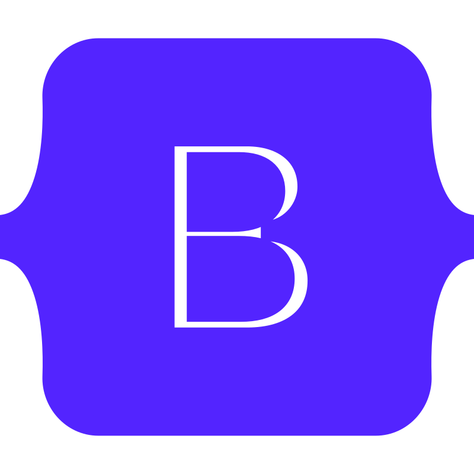
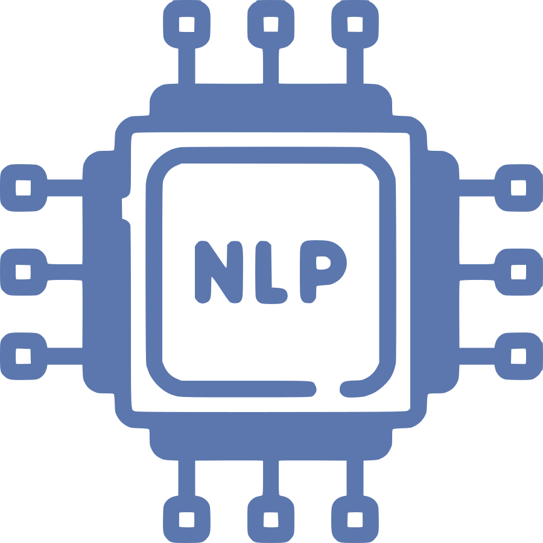
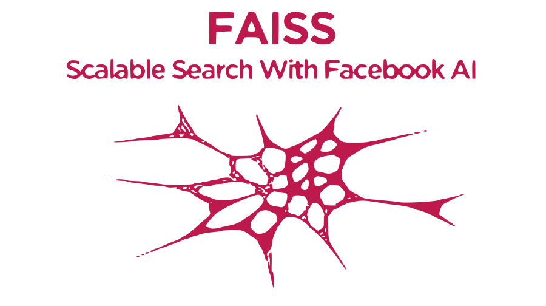
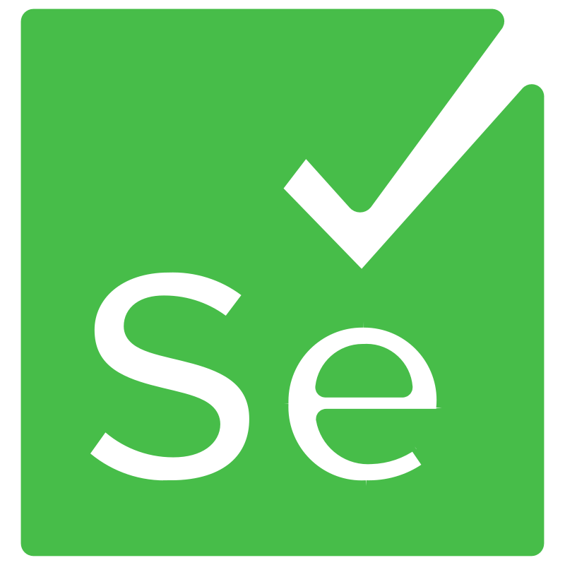
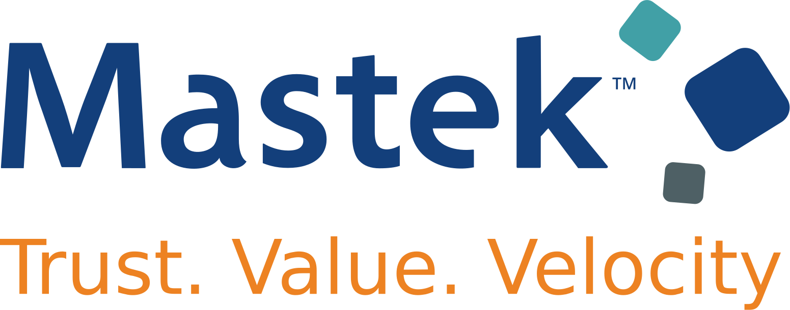

#  &nbsp; Hi, I am Srushti Sambare. &nbsp; 
----------------------------------

## Skills

  
  
  
  
  
  
    
  
  
  
  
  
  
  
  
  
  
  
  
  
  
  
  
  

---------------------------------

## Work Experience

Attributions:
| <a href="https://www.flaticon.com/free-icons/nlp" title="nlp icons">Nlp icons created by Freepik - Flaticon</a> |
<a href="https://www.flaticon.com/free-icons/large-language-model" title="large language model icons">Large language model icons created by LAFS - Flaticon</a>
