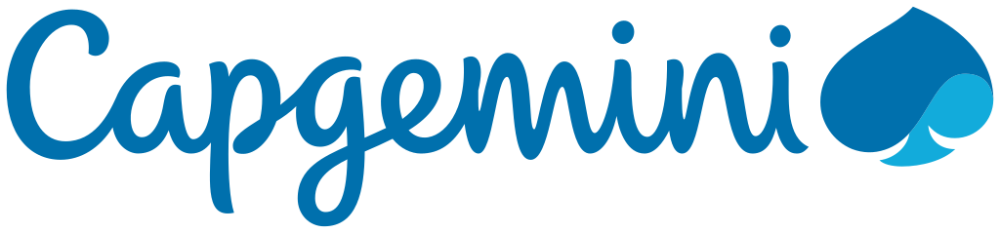
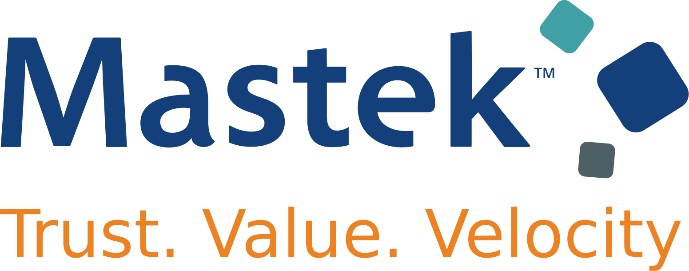

#  &nbsp; Hi, I am Srushti Sambare. &nbsp; 
----------------------------------
## Skills

### Programming Languages

### Web Development

### App Development

### Artificial Intelligence

### Cloud Computing

### Testing

### Databases

---------------------------------

## Work Experience

---------------------------------

## GitHub Stats

## LeetCode

